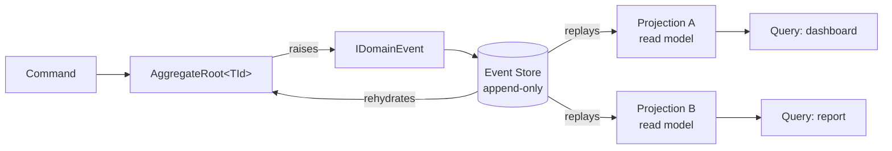

# Event Sourcing

Compendium treats the **event log as the source of truth**. Aggregates do not persist their *current state* — they persist the sequence of facts (events) that produced it, and any state you observe is a derived projection over that log.

This page explains why we made that call, the moving parts you will encounter, and the small set of rules that keep the model honest. For the decision and trade-offs, see [ADR 0005 — Event sourcing over state-stored persistence](../adr/0005-event-sourcing-vs-state.md).

## Why event sourcing

The domains Compendium targets — multi-tenant SaaS, billing-aware workflows, platform engineering — share three pressures that bias us away from CRUD:

- **Audit is not optional.** Compliance, ops, and customer support need to know *who* did *what*, *when*, and *in what order*. With CRUD, the previous value is overwritten on every save and you end up bolting on history tables that duplicate the schema badly. With an event log, the audit trail *is* the database — there is no separate "history" because there is no other history.
- **Many read shapes per write.** A `Subscription` aggregate feeds a billing dashboard, a usage report, an admin audit view, and a tenant-facing activity feed — each with a different shape and different freshness tolerance. Event sourcing lets you build each as an independent projection, without coupling write-side schema changes to read-side queries.
- **Time-travel and replay are routine.** Reproducing a bug ("what did this customer's account look like on April 3?"), backfilling a new feature into history, or recovering a corrupted read model is one `replay-from-position` away — not a database forensic exercise.
- **Multi-tenancy fits naturally.** Streams are partitioned per aggregate, and aggregate IDs are tenant-scoped, so isolation is structural rather than enforced by every query.

The cost — schema evolution, idempotent projections, eventual consistency on the read side — is real. But in CRUD systems we pay it anyway, piecemeal: audit tables, change-data-capture, ad-hoc history queries. Event sourcing pays it once, deliberately, with a single coherent model.

## The model



The flow is one-directional: **commands** mutate aggregates, aggregates emit **events**, events go to the **event store**, and **projections** asynchronously derive read models from the event stream. Aggregates are rehydrated for the next command by replaying their stream (with optional snapshots as a performance optimisation, never as the source of truth).

## Concepts

### `IDomainEvent`

A domain event is an immutable record of something that happened. The interface is small on purpose — five fields the framework needs in order to position, version, and correlate events:

```csharp
public interface IDomainEvent
{
    Guid EventId { get; }
    string AggregateId { get; }
    string AggregateType { get; }
    DateTimeOffset OccurredOn { get; }
    long AggregateVersion { get; }
    int EventVersion { get; }
}
```

Source: [`src/Core/Compendium.Core/Domain/Events/IDomainEvent.cs#L14-L47`](https://github.com/sassy-solutions/compendium/blob/fe1ab5b7388a80f2d9b87bef9bcc543a6854be89/src/Core/Compendium.Core/Domain/Events/IDomainEvent.cs#L14-L47).

`EventVersion` is what makes schema evolution survivable: when the shape of an event changes, you bump the version and register an upcaster in `Compendium.Core.EventSourcing` so old streams keep replaying cleanly.

### `AggregateRoot<TId>`

Aggregates are the only place commands turn into events. The base class enforces three invariants: events are deduplicated by `EventId`, mutations bump the version (for optimistic concurrency), and the uncommitted-event buffer is drained atomically when the repository persists:

```csharp
protected void AddDomainEvent(IDomainEvent domainEvent)
{
    if (_disposed)
    {
        throw new ObjectDisposedException(nameof(AggregateRoot<TId>));
    }

    ArgumentNullException.ThrowIfNull(domainEvent);

    var eventHash = ComputeEventHash(domainEvent);

    _lockingStrategy.ExecuteWrite(() =>
    {
        if (_eventHashes.Add(eventHash))
        {
            _domainEvents.Add(domainEvent);
        }
    });
}
```

Source: [`src/Core/Compendium.Core/Domain/Primitives/AggregateRoot.cs#L65-L83`](https://github.com/sassy-solutions/compendium/blob/fe1ab5b7388a80f2d9b87bef9bcc543a6854be89/src/Core/Compendium.Core/Domain/Primitives/AggregateRoot.cs#L65-L83).

A typical command-handling method looks like this — check invariants, mutate, raise the event, bump the version:

```csharp
public class Order : AggregateRoot<OrderId>
{
    public void PlaceOrder()
    {
        CheckRule(new OrderMustHaveItemsRule(Items));

        Status = OrderStatus.Placed;
        AddDomainEvent(new OrderPlacedEvent(Id, CustomerId, TotalAmount));
        IncrementVersion();
    }
}
```

The aggregate never writes to the store directly. The repository drains uncommitted events (`GetUncommittedEvents`) and appends them to the `IEventStore` with the `expectedVersion` it loaded at, which is how optimistic concurrency is enforced.

### Idempotent projections

Projections are read models built by folding events into a derived shape. They must be **idempotent** — replayed from position 0 they reproduce the same state, and re-applying an event already seen is a no-op or a deterministic overwrite. The `IProjection<TEvent>` interface keeps that contract small:

```csharp
public interface IProjection<in TEvent> : IProjection
    where TEvent : IDomainEvent
{
    Task ApplyAsync(TEvent @event, EventMetadata metadata, CancellationToken cancellationToken = default);
}
```

Source: [`src/Infrastructure/Compendium.Infrastructure/Projections/IProjection.cs#L37-L48`](https://github.com/sassy-solutions/compendium/blob/fe1ab5b7388a80f2d9b87bef9bcc543a6854be89/src/Infrastructure/Compendium.Infrastructure/Projections/IProjection.cs#L37-L48).

The example `OrderSummaryProjection` ships in `Compendium.Infrastructure.Projections.Examples` and shows the typical pattern: maintain a dictionary keyed by aggregate id, overwrite-on-create, mutate-on-subsequent-events:

```csharp
public Task ApplyAsync(OrderPlacedEvent @event, EventMetadata metadata, CancellationToken cancellationToken = default)
{
    _summaries[@event.OrderId] = new OrderSummary
    {
        OrderId = @event.OrderId,
        CustomerId = @event.CustomerId,
        Total = @event.Total,
        Status = OrderStatus.Placed,
        PlacedAt = @event.OccurredOn.DateTime,
        TenantId = metadata.TenantId,
        ItemCount = @event.Items?.Count ?? 0
    };

    return Task.CompletedTask;
}
```

Source: [`src/Infrastructure/Compendium.Infrastructure/Projections/Examples/OrderProjections.cs#L29-L43`](https://github.com/sassy-solutions/compendium/blob/fe1ab5b7388a80f2d9b87bef9bcc543a6854be89/src/Infrastructure/Compendium.Infrastructure/Projections/Examples/OrderProjections.cs#L29-L43).

The projection manager (`EnhancedProjectionManager`) tracks a checkpoint per projection so live processing resumes where it left off, and rebuilds run from position 0 against a fresh state.

### Snapshots

Snapshots are a cache, not a checkpoint. For long-lived aggregates (thousands of events) we periodically capture state to avoid replaying from scratch on rehydration. The contract: an aggregate must always be reconstructible from events alone. If a snapshot is corrupted or missing, the framework replays from the log — never refuses to load.

## Rules of the model

A few invariants are easy to drift from and worth naming explicitly:

1. **Events are immutable, past-tense facts.** `OrderPlaced`, not `PlaceOrder`. Once written, an event is never edited; corrections are *new* events (`OrderCancelled`, `OrderAmountCorrected`).
2. **Only aggregates emit events.** Services and adapters call into aggregates; they don't fabricate events on the side. This keeps the audit trail honest.
3. **Projections derive, never mutate the log.** A projection that needs to "fix history" is a sign the wrong layer is doing the work — emit a corrective event from the aggregate instead.
4. **`expectedVersion` is non-optional.** Append calls assert the version they read at; concurrency conflicts surface as errors, not silent overwrites.

## Where to look in the code

- Aggregate base class: [`src/Core/Compendium.Core/Domain/Primitives/AggregateRoot.cs`](https://github.com/sassy-solutions/compendium/blob/fe1ab5b7388a80f2d9b87bef9bcc543a6854be89/src/Core/Compendium.Core/Domain/Primitives/AggregateRoot.cs)
- Event interface and base: `src/Core/Compendium.Core/Domain/Events/`
- Event store contract: [`src/Abstractions/Compendium.Abstractions/EventSourcing/IEventStore.cs`](https://github.com/sassy-solutions/compendium/blob/fe1ab5b7388a80f2d9b87bef9bcc543a6854be89/src/Abstractions/Compendium.Abstractions/EventSourcing/IEventStore.cs)
- Projection plumbing: [`src/Infrastructure/Compendium.Infrastructure/Projections/`](https://github.com/sassy-solutions/compendium/tree/fe1ab5b7388a80f2d9b87bef9bcc543a6854be89/src/Infrastructure/Compendium.Infrastructure/Projections)
- PostgreSQL event store adapter: `src/Adapters/Compendium.Adapters.PostgreSQL/EventStore/`

## Related

- [ADR 0005 — Event sourcing over state-stored persistence](../adr/0005-event-sourcing-vs-state.md) — the decision and the trade-offs
- [Result Pattern](result-pattern.md) — every event-store operation returns `Result<T>`; failures are values, not exceptions
- [Hexagonal Architecture](hexagonal-architecture.md) — why the event store is a port, with PostgreSQL as one adapter
- [Multi-tenancy](multi-tenancy.md) — how tenant context flows through events and projections
