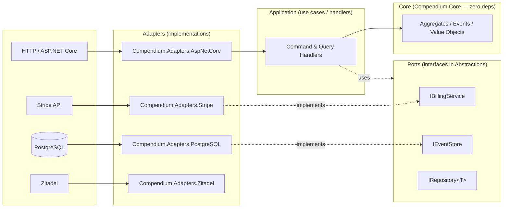

# Hexagonal Architecture

Compendium is organised as a hexagon: a **dependency-free domain Core** at the centre, an **Application** layer that orchestrates use cases, and **Adapters** at the edges that translate between the outside world and the Core's contracts. Adapters depend on the Core; the Core depends on nothing.

This shape — Alistair Cockburn's "ports and adapters" — is the structural commitment that makes the rest of the framework's choices viable. Without it, "swappable adapters" and "testable in isolation" become aspirations rather than properties of the code.

For the rationale, see [ADR 0002 — Hexagonal architecture](../adr/0002-hexagonal-architecture.md) and [ADR 0003 — Zero-dependency Core](../adr/0003-zero-dep-core.md).

## Why hexagonal

Three forces drive the choice:

- **The Core has to outlive its infrastructure.** Database engines, identity providers, billing platforms, and message brokers all change on different cycles. If business rules live in the same project as a Postgres driver, every infra change drags the domain through compilation, code review, and regression testing. Ports keep the domain stable while adapters churn.
- **Tests are only fast and trustworthy if they can avoid I/O.** A pure-domain test boots in milliseconds, has no flakiness, and survives infra outages. That is only possible when the domain has *zero* infrastructure references — not "mocked" infrastructure, *no* infrastructure.
- **Adapter swaps must be a packaging decision, not a rewrite.** Today Stripe, tomorrow LemonSqueezy, the day after Paddle. The Core sees `IBillingService`; the application picks the adapter at composition time. No `if (provider == "stripe")` switches in domain code.

## The shape



Reading the diagram: requests flow inward (HTTP → adapter → application → domain), and the domain talks to the outside world only through ports it owns. The arrows from adapters to ports are *implementation* arrows — adapters depend on the abstractions, not the other way around. This is the Dependency Inversion Principle made structural.

## Layer rules

The rules are simple and enforced by project references in `Compendium.sln`:

| Layer | Project prefix | Allowed dependencies |
|---|---|---|
| Core | `Compendium.Core` | .NET BCL only |
| Abstractions | `Compendium.Abstractions.*` | Core |
| Application | `Compendium.Application` | Core, Abstractions |
| Infrastructure | `Compendium.Infrastructure` | Core, Abstractions |
| Adapters | `Compendium.Adapters.*` | Core, Abstractions, Infrastructure (sometimes), and the *one* third-party SDK they wrap |
| Multitenancy | `Compendium.Multitenancy` | Core, Abstractions |

If a Core class needs `Microsoft.Extensions.DependencyInjection` or `System.Text.Json.JsonSerializerOptions`, it does not belong in Core. That rule is the entire reason ports exist.

## Ports: interfaces in `Abstractions`

A port is an interface the Core needs but does not implement. We keep ports in `Compendium.Abstractions.*` projects, grouped by capability — billing, identity, email, AI, persistence — so consumers reference only the ports they actually use.

`IBillingService` is a representative example. The Core (or, more often, the Application layer) needs "create a checkout session, look up a customer, generate a portal URL" — but has no opinion on which provider does that work:

```csharp
public interface IBillingService
{
    Task<Result<CheckoutSession>> CreateCheckoutSessionAsync(CreateCheckoutRequest request, CancellationToken cancellationToken = default);

    Task<Result<BillingCustomer>> GetCustomerAsync(string customerId, CancellationToken cancellationToken = default);

    Task<Result<BillingCustomer>> GetCustomerByEmailAsync(string email, CancellationToken cancellationToken = default);

    Task<Result<BillingCustomer>> UpsertCustomerAsync(UpsertCustomerRequest request, CancellationToken cancellationToken = default);

    Task<Result<string>> CreateCustomerPortalUrlAsync(string customerId, string? returnUrl = null, CancellationToken cancellationToken = default);
}
```

Source: [`src/Abstractions/Compendium.Abstractions.Billing/IBillingService.cs#L17-L59`](https://github.com/sassy-solutions/compendium/blob/fe1ab5b7388a80f2d9b87bef9bcc543a6854be89/src/Abstractions/Compendium.Abstractions.Billing/IBillingService.cs#L17-L59).

Two things to notice:

1. **No provider types leak.** No `Stripe.Customer`, no `Stripe.Checkout.Session`. The port speaks the domain's vocabulary (`BillingCustomer`, `CheckoutSession`) and adapters translate.
2. **Every fallible call returns `Result<T>`.** Network failures, validation errors, and not-found are values; the Core never has to catch a `StripeException`. See [Result Pattern](result-pattern.md).

## Adapters: implementations at the edge

An adapter is the only place where a third-party SDK is allowed. `StripeBillingService` lives in `Compendium.Adapters.Stripe`, references `Stripe.net`, and translates between `Stripe.*` types and the port's domain types:

```csharp
public async Task<Result<CheckoutSession>> CreateCheckoutSessionAsync(
    CreateCheckoutRequest request,
    CancellationToken cancellationToken = default)
{
    ArgumentNullException.ThrowIfNull(request);

    try
    {
        var opts = new SessionCreateOptions
        {
            Mode = "subscription",
            LineItems = new List<SessionLineItemOptions>
            {
                new() { Price = request.VariantId, Quantity = 1 }
            },
            SuccessUrl = request.SuccessUrl,
            CancelUrl = request.CancelUrl,
            CustomerEmail = request.Email,
            Metadata = ToMetadata(request.CustomData, request.UserId)
        };

        var service = new SessionService();
        var session = await service.CreateAsync(opts, cancellationToken: cancellationToken);

        return Result.Success(StripeMapper.ToCheckoutSession(session));
    }
    catch (StripeException ex)
    {
        _logger.LogError(ex, "Stripe checkout session creation failed: {Message}", ex.Message);
        return Result.Failure<CheckoutSession>(
            Error.Failure("Billing.Stripe.CheckoutFailed", ex.Message));
    }
}
```

Source: [`src/Adapters/Compendium.Adapters.Stripe/Services/StripeBillingService.cs#L39-L83`](https://github.com/sassy-solutions/compendium/blob/fe1ab5b7388a80f2d9b87bef9bcc543a6854be89/src/Adapters/Compendium.Adapters.Stripe/Services/StripeBillingService.cs#L39-L83).

Three patterns to notice — they recur in every adapter:

- **Catch SDK exceptions at the boundary, return `Result.Failure(Error)`.** The Core does not see `StripeException`; the Application layer sees a typed `Error` it can branch on.
- **Map provider types to domain types.** `StripeMapper.ToCheckoutSession(session)` is the seam. If Stripe changes its model, the change stops at the mapper.
- **`internal sealed`.** Adapters are wired through DI extensions (`AddStripeBilling(...)`); the type itself is not part of the public API.

The same shape repeats across `Compendium.Adapters.LemonSqueezy`, `Compendium.Adapters.PostgreSQL`, `Compendium.Adapters.Zitadel`, and so on. Swapping providers is a `services.AddStripeBilling(...)` → `services.AddLemonSqueezyBilling(...)` change at composition time.

## The "zero-dep Core" rule

The Core's `csproj` references **nothing** beyond the .NET BCL. No `Microsoft.Extensions.*`, no JSON library, no logging abstraction, no MediatR, no DI container. The discipline pays off in three ways:

1. **Tests are pure.** A test against an aggregate boots no host, opens no connection, and runs in microseconds.
2. **Versioning is decoupled.** A breaking change in `Microsoft.Extensions.Logging.Abstractions` cannot force a Core release.
3. **The boundary is obvious.** When a contributor proposes adding a dependency to Core, the discussion is structural, not stylistic — the rule is "no", and the workaround is "introduce a port."

ADR 0003 documents the rule and the exceptions (which are essentially: BCL only, with `System.Text.Json` allowed *only* in the secure event deserialiser because the alternative is unsafe).

## What this buys you

- **Replaceable infrastructure.** Today's PostgreSQL event store can become tomorrow's EventStoreDB without touching aggregates.
- **Honest tests.** Domain tests don't need fixtures; integration tests target adapters specifically.
- **Independent release cadence.** The Core and an adapter version separately because they *are* separate.
- **A clean conversation about dependencies.** "Where does this go?" has a structural answer, not a taste-based one.

## Where to look in the code

- Solution layout: [`Compendium.sln`](https://github.com/sassy-solutions/compendium/blob/fe1ab5b7388a80f2d9b87bef9bcc543a6854be89/Compendium.sln)
- Core (zero-dep): [`src/Core/Compendium.Core/`](https://github.com/sassy-solutions/compendium/tree/fe1ab5b7388a80f2d9b87bef9bcc543a6854be89/src/Core/Compendium.Core)
- Ports: [`src/Abstractions/`](https://github.com/sassy-solutions/compendium/tree/fe1ab5b7388a80f2d9b87bef9bcc543a6854be89/src/Abstractions)
- Adapters: [`src/Adapters/`](https://github.com/sassy-solutions/compendium/tree/fe1ab5b7388a80f2d9b87bef9bcc543a6854be89/src/Adapters)

## Related

- [ADR 0002 — Hexagonal architecture](../adr/0002-hexagonal-architecture.md)
- [ADR 0003 — Zero-dependency Core](../adr/0003-zero-dep-core.md)
- [Result Pattern](result-pattern.md) — the contract every port uses for failures
- [Event Sourcing](event-sourcing.md) — `IEventStore` is the canonical example of a port
- [Multi-tenancy](multi-tenancy.md) — how the tenant context port threads through adapters
