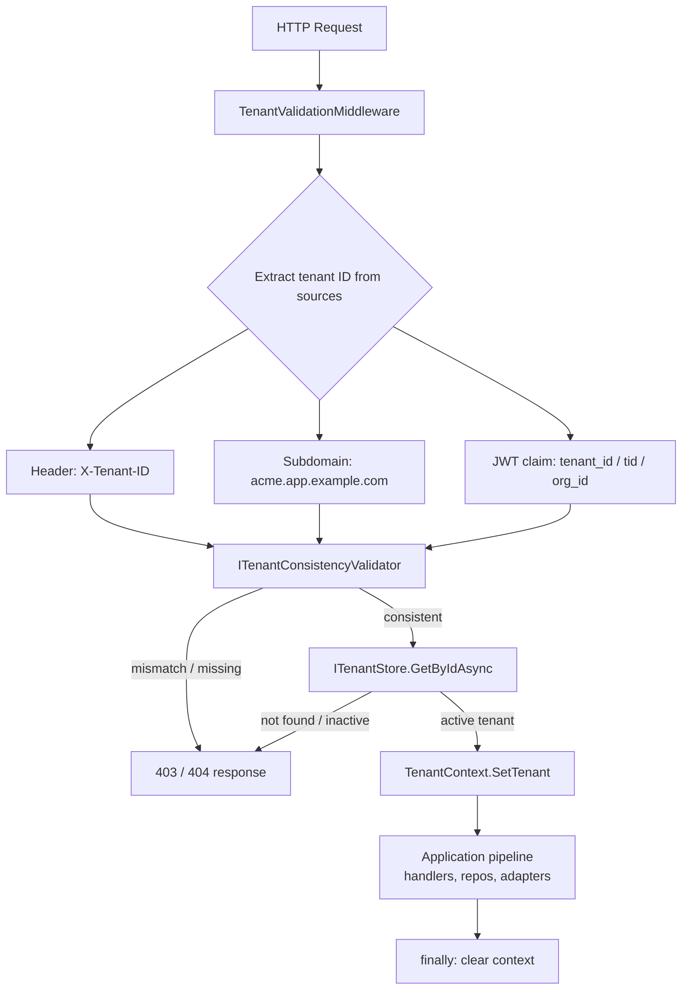

# Multi-tenancy

Compendium is **SaaS-first**: every operation runs in the context of a tenant, tenant isolation is enforced at the infrastructure layer (not just by application-level filters), and a request that can't be confidently attributed to one tenant is rejected before it touches a handler.

This page explains how a request becomes a tenant-scoped execution context, how Compendium reconciles tenant identity from multiple HTTP-level signals, and which isolation strategy fits which workload. For the decision, see [ADR 0004 — Multi-tenancy strategy](../adr/0004-multi-tenancy-strategy.md).

## Why infra-level isolation

The tempting design is "just add a `WHERE tenant_id = @id` to every query." It collapses for three reasons:

- **One missed filter is a data leak.** New endpoints, new join tables, new background jobs, a new ORM developer — every change is a chance to forget. Defence in depth at the infra layer (row-level security, schema-per-tenant, or distinct databases) makes "I forgot the filter" a 0-row result instead of a cross-tenant breach.
- **Tenant identity comes from multiple sources.** A header, a subdomain, and a JWT claim can all carry a tenant ID, and they need to *agree*. Reconciling them in every controller is duplicated, error-prone, and easy to bypass.
- **Tenant context has to flow.** The aggregate, the event, the projection, the outgoing HTTP call to a downstream service — they all need to know which tenant they're acting on behalf of, without every method threading a `tenantId` parameter.

Compendium's answer is a small set of components: a `TenantContext` that flows via `AsyncLocal`, a middleware that resolves and validates tenant identity at the edge, and a `TenantIsolation` primitive that wraps connection-string-level scoping for adapters.

## The flow



A request only reaches a handler if (a) at least one source supplied a tenant ID, (b) all supplied sources agree, and (c) the resolved tenant exists and is active. Anything else is a 4xx at the edge.

## Tenant sources

Three sources, each appropriate for a different access pattern:

| Source | Where | Typical use |
|---|---|---|
| HTTP header | `X-Tenant-ID: acme` | Service-to-service calls, internal admin tools, programmatic API clients |
| Subdomain | `acme.app.example.com` | Browser-based SaaS — tenant is part of the user's URL |
| JWT claim | `tenant_id` / `tid` / `org_id` / `urn:zitadel:iam:org:id` | Authenticated users — tenant is part of the identity token |

In practice you usually have *two* sources (e.g. subdomain + JWT). The validator's job is to make sure they don't disagree.

## Consistency validation

`TenantValidationMiddleware` extracts every available source and hands them to `ITenantConsistencyValidator`. The result is `Result<string>` — either the resolved tenant ID or a typed error:

```csharp
public Result<string> Validate(TenantSourceIdentifiers sources)
{
    ArgumentNullException.ThrowIfNull(sources);

    if (sources.SourceCount == 0)
    {
        if (_options.RequireAtLeastOneSource)
        {
            _logger.LogWarning("No tenant identifier found in any source");
            return Result.Failure<string>(TenantErrors.NoTenantIdentifier());
        }

        return Result.Success(string.Empty);
    }

    if (_options.MinimumRequiredSources > 0 && sources.SourceCount < _options.MinimumRequiredSources)
    {
        return Result.Failure<string>(TenantErrors.InsufficientSources(
            _options.MinimumRequiredSources,
            sources.SourceCount));
    }

    if (!sources.AreConsistent)
    {
        _logger.LogWarning(
            "Tenant ID mismatch detected. Header: {Header}, Subdomain: {Subdomain}, JWT: {Jwt}",
            sources.HeaderTenantId ?? "(none)",
            sources.SubdomainTenantId ?? "(none)",
            sources.JwtTenantId ?? "(none)");

        return Result.Failure<string>(TenantErrors.TenantMismatch(
            sources.HeaderTenantId,
            sources.SubdomainTenantId,
            sources.JwtTenantId));
    }

    var tenantId = sources.ResolvedTenantId!;
    return Result.Success(tenantId);
}
```

Source: [`src/Multitenancy/Compendium.Multitenancy/TenantConsistencyValidator.cs#L97-L147`](https://github.com/sassy-solutions/compendium/blob/fe1ab5b7388a80f2d9b87bef9bcc543a6854be89/src/Multitenancy/Compendium.Multitenancy/TenantConsistencyValidator.cs#L97-L147).

Three policy knobs on `TenantConsistencyOptions`:

- `RequireAtLeastOneSource` — should anonymous (no-tenant) requests be allowed at all? Default `true`.
- `MinimumRequiredSources` — for high-sensitivity APIs you can demand 2 or 3 agreeing sources (e.g. JWT *and* subdomain) to harden against a single compromised credential.
- `ExcludedPaths` — health checks, metrics, and `.well-known` endpoints bypass tenant validation entirely.

## The middleware

`TenantValidationMiddleware` (in `Compendium.Adapters.AspNetCore`) is the single edge component that translates HTTP into a tenant-scoped pipeline:

```csharp
public async Task InvokeAsync(
    HttpContext context,
    ITenantConsistencyValidator validator,
    ITenantStore tenantStore,
    TenantContext tenantContext)
{
    if (IsExcludedPath(context.Request.Path))
    {
        await _next(context);
        return;
    }

    var sources = ExtractTenantSources(context);
    var validationResult = validator.Validate(sources);

    if (validationResult.IsFailure)
    {
        await WriteErrorResponse(context, validationResult.Error.Message, StatusCodes.Status403Forbidden);
        return;
    }

    var tenantId = validationResult.Value;

    if (!string.IsNullOrEmpty(tenantId))
    {
        var tenantResult = await tenantStore.GetByIdAsync(tenantId, context.RequestAborted);

        if (tenantResult.IsFailure || tenantResult.Value is null)
        {
            await WriteErrorResponse(context, TenantErrors.TenantNotFound(tenantId).Message, StatusCodes.Status404NotFound);
            return;
        }

        if (!tenantResult.Value.IsActive)
        {
            await WriteErrorResponse(context, TenantErrors.TenantAccessDenied(tenantId).Message, StatusCodes.Status403Forbidden);
            return;
        }

        tenantContext.SetTenant(tenantResult.Value);
    }

    try
    {
        await _next(context);
    }
    finally
    {
        tenantContext.SetTenant(null);
    }
}
```

Source: [`src/Adapters/Compendium.Adapters.AspNetCore/Security/TenantValidationMiddleware.cs#L43-L119`](https://github.com/sassy-solutions/compendium/blob/fe1ab5b7388a80f2d9b87bef9bcc543a6854be89/src/Adapters/Compendium.Adapters.AspNetCore/Security/TenantValidationMiddleware.cs#L43-L119).

The shape worth noticing:

1. **Extract → Validate → Lookup → Set → Run → Clear.** No tenant context survives the request boundary; `finally` resets the `AsyncLocal` so a misconfigured worker can't leak state across requests.
2. **Two layers of failure.** Inconsistent sources are `403 Forbidden` (caller is doing something wrong); active-but-missing or inactive tenant is `404 Not Found` / `403`.
3. **The middleware is the *only* place tenant gets set.** Handlers and adapters consume `ITenantContext`; they never write it.

## How tenant context flows

`TenantContext` uses `AsyncLocal<TenantInfo?>`, which means it follows the `async`/`await` machinery automatically — handlers, repositories, projection processors, and outbound HTTP calls all see the same tenant without needing to thread it through arguments:

```csharp
public sealed class TenantContext : ITenantContext
{
    private readonly AsyncLocal<TenantInfo?> _currentTenant = new();

    public string? TenantId => _currentTenant.Value?.Id;
    public string? TenantName => _currentTenant.Value?.Name;
    public TenantInfo? CurrentTenant => _currentTenant.Value;
    public bool HasTenant => _currentTenant.Value is not null;

    public void SetTenant(TenantInfo? tenant)
    {
        _currentTenant.Value = tenant;
    }
}
```

Source: [`src/Multitenancy/Compendium.Multitenancy/TenantContext.cs#L34-L66`](https://github.com/sassy-solutions/compendium/blob/fe1ab5b7388a80f2d9b87bef9bcc543a6854be89/src/Multitenancy/Compendium.Multitenancy/TenantContext.cs#L34-L66).

Two things that fall out of this:

- **Outbound HTTP calls inherit the tenant.** `TenantPropagatingDelegatingHandler` (in `Compendium.Multitenancy.Http`) reads the current `ITenantContext` and adds `X-Tenant-ID` to outgoing requests, so service-to-service calls preserve scope without per-call boilerplate.
- **Background work needs explicit scopes.** Hosted services and queue consumers don't have an inbound HTTP request to set context, so they must use `TenantScope` (a disposable that wraps a temporary `SetTenant`) before doing tenant work.

## Isolation strategies

ADR 0004 covers the trade-offs in depth; the short version is that Compendium supports three isolation levels and lets you pick per workload:

| Strategy | Storage shape | Cost | Blast radius of a bug | When to use |
|---|---|---|---|---|
| **Database-per-tenant** | One physical DB per tenant | High (connection pools, migrations) | Smallest — bug only sees one tenant's DB | Regulated workloads, very large tenants, residency requirements |
| **Schema-per-tenant** | One DB, schema per tenant | Medium (schema management at scale) | Schema-bounded — one tenant per connection | Mid-sized SaaS with moderate isolation needs |
| **Row-level (RLS)** | Shared schema, `tenant_id` column + Postgres Row-Level Security | Low | RLS-enforced — even a missed `WHERE` clause is filtered by the database | Default for most SaaS — fast, cheap, defence-in-depth |

Compendium's PostgreSQL adapter ships row-level helpers in `Compendium.Adapters.PostgreSQL.Security` (`RowLevelSecurityExtensions`) that set the `app.current_tenant` session variable from `ITenantContext` before each query. The application code keeps writing normal SQL; Postgres enforces the partition.

## Where to look in the code

- Tenant context: [`src/Multitenancy/Compendium.Multitenancy/TenantContext.cs`](https://github.com/sassy-solutions/compendium/blob/fe1ab5b7388a80f2d9b87bef9bcc543a6854be89/src/Multitenancy/Compendium.Multitenancy/TenantContext.cs)
- Consistency validator: [`src/Multitenancy/Compendium.Multitenancy/TenantConsistencyValidator.cs`](https://github.com/sassy-solutions/compendium/blob/fe1ab5b7388a80f2d9b87bef9bcc543a6854be89/src/Multitenancy/Compendium.Multitenancy/TenantConsistencyValidator.cs)
- ASP.NET Core middleware: [`src/Adapters/Compendium.Adapters.AspNetCore/Security/TenantValidationMiddleware.cs`](https://github.com/sassy-solutions/compendium/blob/fe1ab5b7388a80f2d9b87bef9bcc543a6854be89/src/Adapters/Compendium.Adapters.AspNetCore/Security/TenantValidationMiddleware.cs)
- Outbound propagation: [`src/Multitenancy/Compendium.Multitenancy/Http/TenantPropagatingDelegatingHandler.cs`](https://github.com/sassy-solutions/compendium/blob/fe1ab5b7388a80f2d9b87bef9bcc543a6854be89/src/Multitenancy/Compendium.Multitenancy/Http/TenantPropagatingDelegatingHandler.cs)
- Tenant isolation primitive: [`src/Multitenancy/Compendium.Multitenancy/TenantIsolation.cs`](https://github.com/sassy-solutions/compendium/blob/fe1ab5b7388a80f2d9b87bef9bcc543a6854be89/src/Multitenancy/Compendium.Multitenancy/TenantIsolation.cs)
- Postgres row-level security wiring: [`src/Adapters/Compendium.Adapters.PostgreSQL/Security/RowLevelSecurityExtensions.cs`](https://github.com/sassy-solutions/compendium/blob/fe1ab5b7388a80f2d9b87bef9bcc543a6854be89/src/Adapters/Compendium.Adapters.PostgreSQL/Security/RowLevelSecurityExtensions.cs)

## Related

- [ADR 0004 — Multi-tenancy strategy](../adr/0004-multi-tenancy-strategy.md)
- [Hexagonal Architecture](hexagonal-architecture.md) — `ITenantContext` and `ITenantStore` are ports; the middleware and store implementations are adapters
- [Result Pattern](result-pattern.md) — tenant validation, lookup, and access-denied conditions are all returned as typed `Result`/`Error` rather than thrown
- [Event Sourcing](event-sourcing.md) — events and projections carry `TenantId` in metadata so the audit trail is tenant-aware end-to-end
