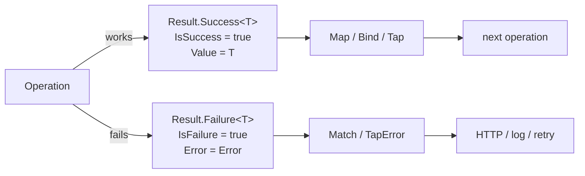

# The Result Pattern

In Compendium, **errors are values, not exceptions**. Every fallible operation returns `Result` (no value) or `Result<T>` (with a value), and every failure carries a typed `Error`. Callers branch on `IsSuccess`, chain with `Map` / `Bind`, or destructure with `Match`. Exceptions exist for *bugs* (null arguments, disposed objects, programmer errors) — never for control flow.

For the rationale, see [ADR 0001 — The Result pattern](../adr/0001-result-pattern.md).

## Why no exceptions

Exceptions are a fine tool for one job — *unwinding the stack when something is broken*. They are a poor tool for the job most application code is doing — *signalling that an expected, recoverable condition occurred and the caller should choose what to do next*.

The case against exception-as-control-flow:

- **Invisibility in the type system.** A method that `throws` looks identical to one that doesn't. The compiler can't tell you that you forgot to handle a `StripeException` — only production can. Result types put failure on the signature where it can't be missed.
- **Cost on the hot path.** Throwing is expensive (stack capture, exception filters); on a request handling 10k events/minute it adds up. `Result` is a single allocation with no stack walk.
- **Action-at-a-distance.** A `try`/`catch` ten frames away can swallow a domain error that should have been handled three frames up. Result types make the handler local and explicit.
- **Bad ergonomics for known failure modes.** "Customer not found" isn't exceptional — it's an outcome. Returning `Result.Failure<BillingCustomer>(BillingErrors.CustomerNotFound(id))` says exactly what happened, with a code the API layer can map to `404`.

What we do still throw on: programmer errors. Null arguments via `ArgumentNullException.ThrowIfNull`, accessing `.Value` on a failed result, using a disposed aggregate. These are bugs, and bugs should crash loudly in development and surface in observability in production.

## The shape



Two states, mutually exclusive. The constructor enforces it: a successful result with an error throws, a failed result with `Error.None` throws.

## The contract

```csharp
public class Result
{
    public bool IsSuccess { get; }
    public bool IsFailure => !IsSuccess;
    public Error Error { get; }

    public static Result Success() { ... }
    public static Result<TValue> Success<TValue>(TValue value) { ... }
    public static Result Failure(Error error) { ... }
    public static Result<TValue> Failure<TValue>(Error error) { ... }

    public static Result Combine(params Result[] results) { ... }

    public static implicit operator Result(Error error) { ... }
}
```

Source: [`src/Core/Compendium.Core/Results/Result.cs#L14-L187`](https://github.com/sassy-solutions/compendium/blob/fe1ab5b7388a80f2d9b87bef9bcc543a6854be89/src/Core/Compendium.Core/Results/Result.cs#L14-L187).

The generic variant adds a `Value` property that *throws if you access it on a failure*. That's deliberate: forgetting to check `IsSuccess` is a bug, and it should fail fast in tests rather than silently propagate `default`.

```csharp
public sealed class Result<TValue> : Result
{
    public TValue Value
    {
        get
        {
            if (IsFailure)
            {
                throw new InvalidOperationException("Cannot access the value of a failed result.");
            }

            return _value!;
        }
    }

    public static implicit operator Result<TValue>(TValue value) { ... }
    public static implicit operator Result<TValue>(Error error) { ... }
}
```

Source: [`src/Core/Compendium.Core/Results/Result.cs#L193-L252`](https://github.com/sassy-solutions/compendium/blob/fe1ab5b7388a80f2d9b87bef9bcc543a6854be89/src/Core/Compendium.Core/Results/Result.cs#L193-L252).

The implicit conversions are an ergonomic win: `return user;` produces `Result.Success(user)`, and `return BillingErrors.CustomerNotFound(id);` produces `Result.Failure<BillingCustomer>(...)`. No factory boilerplate at the call site.

## `Error` as a value object

`Error` is not a string, not an exception, and not an enum. It's a `ValueObject` with a code, a message, a typed category, and optional metadata:

```csharp
public sealed class Error : ValueObject
{
    public static readonly Error None = new(string.Empty, string.Empty, ErrorType.None);

    public string Code { get; }      // e.g. "Billing.Stripe.CheckoutFailed"
    public string Message { get; }
    public ErrorType Type { get; }   // Validation | NotFound | Conflict | Forbidden | ...
    public IReadOnlyDictionary<string, object> Metadata { get; }

    public static Error Validation(string code, string message, ...) { ... }
    public static Error NotFound(string code, string message, ...) { ... }
    public static Error Conflict(string code, string message, ...) { ... }
    public static Error Unauthorized(string code, string message, ...) { ... }
    public static Error Forbidden(string code, string message, ...) { ... }
}
```

Source: [`src/Core/Compendium.Core/Results/Error.cs#L16-L196`](https://github.com/sassy-solutions/compendium/blob/fe1ab5b7388a80f2d9b87bef9bcc543a6854be89/src/Core/Compendium.Core/Results/Error.cs#L16-L196).

`ErrorType` is the bridge to HTTP — adapters mapping a `Result` to an `IActionResult` look at `Type` (not `Code`) to pick `400`, `404`, `409`, `403`. `Code` is the stable identifier for logs, alerting, and i18n. `Metadata` carries field-level validation details, retry hints, etc.

By convention, errors live as static factories on a per-bounded-context class — `BillingErrors.CustomerNotFound(id)`, `TenantErrors.TenantMismatch(...)`. That keeps codes consistent across the codebase and makes them grep-able.

## Composition: `Map`, `Bind`, `Match`

The point of values-over-exceptions is that *you can compose them*. The extension methods in `ResultExtensions` give you the standard functional toolkit:

```csharp
public static Result<TNewValue> Map<TValue, TNewValue>(this Result<TValue> result, Func<TValue, TNewValue> mapper)
{
    ArgumentNullException.ThrowIfNull(result);
    ArgumentNullException.ThrowIfNull(mapper);

    return result.IsSuccess
        ? Result.Success(mapper(result.Value))
        : Result.Failure<TNewValue>(result.Error);
}

public static Result<TNewValue> Bind<TValue, TNewValue>(this Result<TValue> result, Func<TValue, Result<TNewValue>> binder)
{
    ArgumentNullException.ThrowIfNull(result);
    ArgumentNullException.ThrowIfNull(binder);

    return result.IsSuccess
        ? binder(result.Value)
        : Result.Failure<TNewValue>(result.Error);
}
```

Source: [`src/Core/Compendium.Core/Results/ResultExtensions.cs#L63-L89`](https://github.com/sassy-solutions/compendium/blob/fe1ab5b7388a80f2d9b87bef9bcc543a6854be89/src/Core/Compendium.Core/Results/ResultExtensions.cs#L63-L89).

A typical handler reads top-to-bottom as a pipeline, with errors short-circuiting at the first failure:

```csharp
public Task<Result<CheckoutUrl>> Handle(StartCheckout cmd, CancellationToken ct) =>
    _users.GetByIdAsync(cmd.UserId, ct)
        .BindAsync(user => _billing.UpsertCustomerAsync(new UpsertCustomerRequest { Email = user.Email }, ct))
        .BindAsync(customer => _billing.CreateCheckoutSessionAsync(new CreateCheckoutRequest
        {
            VariantId = cmd.PriceId,
            Email = customer.Email,
            SuccessUrl = cmd.SuccessUrl,
            CancelUrl = cmd.CancelUrl
        }, ct))
        .MapAsync(session => new CheckoutUrl(session.Url));
```

If any step fails, the rest is skipped and the original `Error` propagates. No `try`/`catch`, no early returns littering the body, no nullable-checking ceremony.

For terminal handling (e.g. mapping to an HTTP response) use `Match`:

```csharp
return result.Match(
    onSuccess: url => Results.Ok(new { url = url.Value }),
    onFailure: err => err.Type switch
    {
        ErrorType.NotFound      => Results.NotFound(err),
        ErrorType.Validation    => Results.BadRequest(err),
        ErrorType.Unauthorized  => Results.Unauthorized(),
        _                       => Results.Problem(err.Message)
    });
```

## Anti-patterns

A few mistakes recur often enough to be worth naming:

### 1. Don't blindly wrap external exceptions in `Result`

It's tempting to write a helper `Try(() => somethingThatThrows)` that catches everything and stuffs the message into an `Error`. Resist it.

```csharp
// Bad — losing the type and stack of every failure
return Try(() => _stripeSdk.Charge(...));
```

The right shape: catch the *specific* exception types the SDK documents, map each to a *specific* `Error`, and let truly unexpected exceptions propagate (so they show up in your error tracker as bugs, not as `"General.Failure: Object reference not set..."`):

```csharp
// Good — narrow catches, semantically meaningful errors
try
{
    var session = await _stripe.SessionService.CreateAsync(opts, ct);
    return Result.Success(StripeMapper.ToCheckoutSession(session));
}
catch (StripeException ex) when (ex.StripeError?.Type == "card_error")
{
    return Result.Failure<CheckoutSession>(BillingErrors.PaymentDeclined(ex.Message));
}
catch (StripeException ex)
{
    _logger.LogError(ex, "Stripe checkout session creation failed");
    return Result.Failure<CheckoutSession>(Error.Failure("Billing.Stripe.CheckoutFailed", ex.Message));
}
```

This is exactly the pattern `StripeBillingService` uses. See [Hexagonal Architecture](hexagonal-architecture.md) for why this catch-and-translate happens at the adapter boundary.

### 2. Don't throw inside `Bind` / `Map`

If your mapper or binder can fail, return a `Result` from it — don't let it throw. A throwing function inside a `Bind` will propagate as a real exception and bypass all the failure-as-value plumbing the rest of the pipeline relies on.

### 3. Don't access `.Value` without checking `IsSuccess`

`result.Value` throws on failure. That's intentional — but it means `someResult.Value.SomeProp` is a code smell. Use `Map`, `Match`, or an explicit `if (result.IsFailure) return result.Error;`.

### 4. Don't return `Result<Result<T>>`

If you find yourself nesting, you wanted `Bind`, not `Map`. `Map` lifts a regular function (`T -> U`) over a `Result<T>`; `Bind` flattens a `Result`-returning function (`T -> Result<U>`).

### 5. Don't use `string` errors

The implicit conversion from `string` to `Error` exists for ergonomics in trivial cases, but a string error has no `Code`, no `Type`, and no `Metadata`. Production errors should always be constructed via `Error.Validation(...)`, `Error.NotFound(...)`, etc., or via a per-context factory like `BillingErrors`.

## Where to look in the code

- `Result` and `Result<T>`: [`src/Core/Compendium.Core/Results/Result.cs`](https://github.com/sassy-solutions/compendium/blob/fe1ab5b7388a80f2d9b87bef9bcc543a6854be89/src/Core/Compendium.Core/Results/Result.cs)
- `Error` and `ErrorType`: [`src/Core/Compendium.Core/Results/Error.cs`](https://github.com/sassy-solutions/compendium/blob/fe1ab5b7388a80f2d9b87bef9bcc543a6854be89/src/Core/Compendium.Core/Results/Error.cs)
- Functional combinators: [`src/Core/Compendium.Core/Results/ResultExtensions.cs`](https://github.com/sassy-solutions/compendium/blob/fe1ab5b7388a80f2d9b87bef9bcc543a6854be89/src/Core/Compendium.Core/Results/ResultExtensions.cs)
- Real-world adapter usage: [`src/Adapters/Compendium.Adapters.Stripe/Services/StripeBillingService.cs`](https://github.com/sassy-solutions/compendium/blob/fe1ab5b7388a80f2d9b87bef9bcc543a6854be89/src/Adapters/Compendium.Adapters.Stripe/Services/StripeBillingService.cs)
- Per-context error factories: search for `*Errors.cs` (e.g. `BillingErrors`, `TenantErrors`, `IdentityErrors`)

## Related

- [ADR 0001 — The Result pattern](../adr/0001-result-pattern.md)
- [Hexagonal Architecture](hexagonal-architecture.md) — why ports return `Result<T>` and adapters do the catch-and-translate
- [Event Sourcing](event-sourcing.md) — every event-store call returns `Result<T>`; concurrency conflicts are typed errors, not exceptions
- [Multi-tenancy](multi-tenancy.md) — `ITenantConsistencyValidator` returns `Result<string>` for tenant validation
